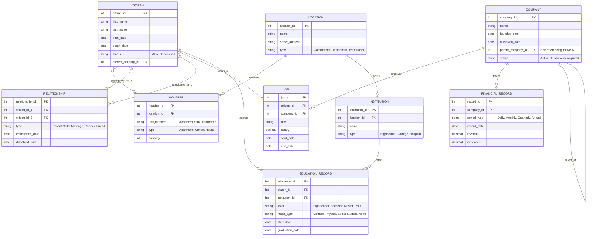

# Smart City
Smart City - database school project

## Project status

The current repository contains the initial domain ERD for the **World Sim**
project. The implementation must satisfy the final-project requirements:
PostgreSQL, MongoDB, and Neo4j solutions; a CRUD backend; a one-time migrator;
authentication and authorization; integration tests; Docker-based local
development; cloud deployment; and persisted AI-based data enrichment.

The scoped implementation plan is in
[docs/PROJECT_PLAN.md](docs/PROJECT_PLAN.md). It defines the core workflows,
database responsibilities, delivery phases, and definition of done.

## Smart City "World Sim" - Entity Relationship Diagram (ERD)

This document outlines the database schema for the persistent simulated city project. It provides a structured foundation for tracking citizens, companies, relationships, real estate, and education history.

### 1. Mermaid ERD Source Code

Copy the code below into any Mermaid-compatible editor (like [Mermaid Live Editor](https://mermaid.live/)) to visualize and edit the diagram with your team.

### 2. Core Tables Explained

#### Citizens & Connections
* **CITIZEN:** The foundation of the sim. Tracks lifetime, current living arrangements, and survival state.
* **RELATIONSHIP:** A bridge / junction table handling many-to-many dynamics between citizens. It records relationships explicitly with type tracking (e.g., historical marriages, parental links, or friendships).

#### Economy & Corporate Tracking
* **COMPANY:** Represents organizations. Built with a self-referencing foreign key (`parent_company_id`) to naturally store corporate takeovers, spin-offs, and mergers.
* **FINANCIAL_RECORD:** A clean time-series design. By utilizing a `period_type` column ("Daily", "Monthly", etc.), a single table elegantly tracks historical growth or decline without splitting schemas.
* **JOB:** Bridges citizens and corporations, maintaining a historical record of employment durations and wages.

#### Geography & Education
* **LOCATION:** Base infrastructure records mapping physical footprints across the city grid.
* **HOUSING:** Real estate footprints handling multi-family settings like apartment complexes mapping back to specific structural locations.
* **INSTITUTION:** Physical entities managing community operations (Schools, Hospitals).
* **EDUCATION_RECORD:** Captures academic tiers (HighSchool, College) paired with specific study focuses (Physics, Medical) across a citizen's timeline.

### Google docs
[Smart City - Google docs link](https://github.com/Gervig/Smart-City)